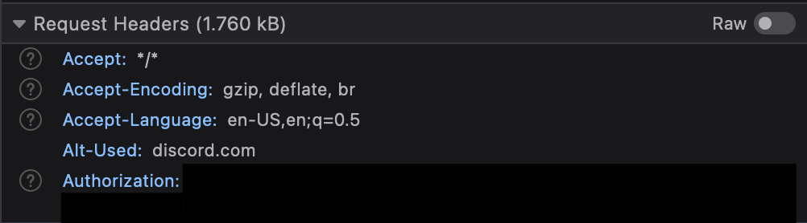

# Clicksafe Intelligence Python Scripts

---
**NOTE: All scripts provided in this repository are without warranty and used at your own risk. These are examples of ones we used during our research process and may not be usuable in future interations of Python or the Discord API. We are not responsible for any misuse of violation of terms of use from the use of these scripts.**

---
## Prerequisites:
---
Required libraries:
* Json
* Requests
* CSV
* Pandas

The prerequisites can be installed via `pip install -r requirements.txt`

These scripts also require Pip and Python 3 to be installed and configured on your device.

How to install Python 3: https://realpython.com/installing-python/

How to install Pip: https://pip.pypa.io/en/stable/installation/

## How to use the scripts

After installing the required modules on your system, run DiscordChannelScrape.py from the commandline.

`python DiscordChannelScrape.py` 

or 

`python3 DiscordChannelScrape.py`

You will need two variables for this script to work:
* Authorization Token from Discord
* Channel ID

To get the **Authorization Token** from Discord do the following:
* Log into a account on Discord on the web
* Select the server and channel that you would like to scrape from
* Open Developer Tools -> Network on your Web Browser of Choice

Firefox: 

Chrome: 

* Reload the page or use the record button in the network traffic to display requests on the page
* Look for the request titled **messages?limit=50** and click on it

Firefox: 

Chrome: 

* Scroll down to Request Headers and you should see the Authorization token for your Discord Account

Firefox: 

Chrome: 

* Copy this Authorization Token to input into the Python Script

To get the **Channel ID**, it will be in the same area of the web browser, and be at the top of the page (within the GET request) where you got the authorization token.

Firefox: 

Chrome: 

* Copy the Channel ID to input into the Python Script

After exporting the data from the Discord server, you can run exportinfofromjson.py from the commandline to export the data into a CSV file. You will need to enter the exported json file name and the name of the csv file you would like exported.

`python exportinfofromjson.py` 

or 

`python3 exportinfofromjson.py`

## Limitations
* Each run of DiscordChannelScrape.py will only return the most recent 50 results from the Discord Channel. 
* Exporting to a CSV file leaves brackets in each cell of the csv
* This script relies on v9 of the Discord API